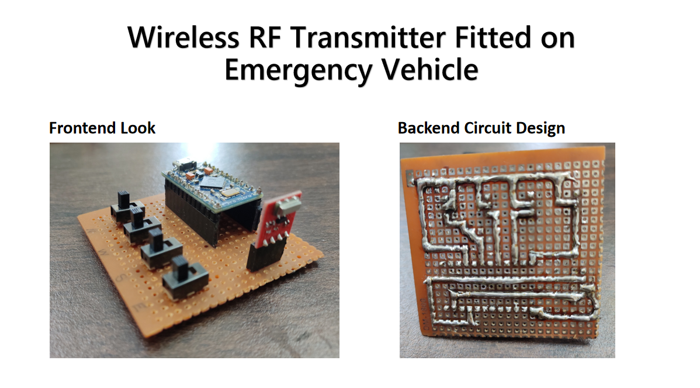

# Traffic-Light-Control
Reliable Mechanism for Emergency Vehicle to <b>avoid getting stuck in Traffic Jam</b> , thereby <b>saving time </b>

### A Transmitter is fitted on the emergency vehicle , the only thing which driver has to do is turn on the switch which will make the signal green and then the driver can reach his destination quicker

 

## Schematic of the System 
 

 

## Final Product

